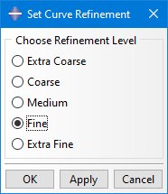

## Plugin for Abaqus/CAE to set curve refinement for all parts

This very simple Plug-In allows to automatically set a curve refinement level for all geometrical parts in the assembly. The built-in option would require to define that for each part separately, which can be annoying. So the possibility to change it for all parts in a model with one action is quite nice.

See also demo video in media folder.
  

